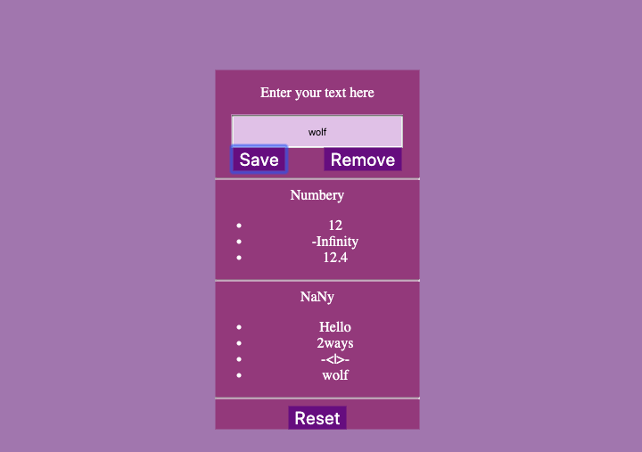

# Numbery & NaNy

> This website will sorts user-provided strings into two categories, _NaNy_ and _Numbery_.  

> 

> Specifications:
> * If a user inputs the same value twice, it will pop an **alert** that will warn about the same character input.  The lists will never have repeated values
> * After a user has removed a value from the state, they should be able to add it again.
> This code was well organized with `development-strategy`! 

> Please check it out by the following link [projects](https://klisabeth.github.io/numbery-and-nany) 
